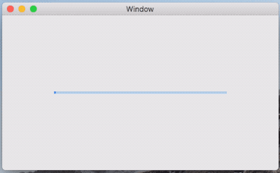

# MPOProgressBar

A simple material design linear progress bar

## Advantages

- Supports both `Determinate` and `Indeterminate` modes
- `CALayer` based implementation, simple and light weight.
- Works on both `iOS` and `macOS` platform

## Attributions

- Original design by `The Material Components authors`, `Google Inc`. Licensed under Apache 2.0.
- Implementation by `Wutian`, Licensed under Apache 2.0.

